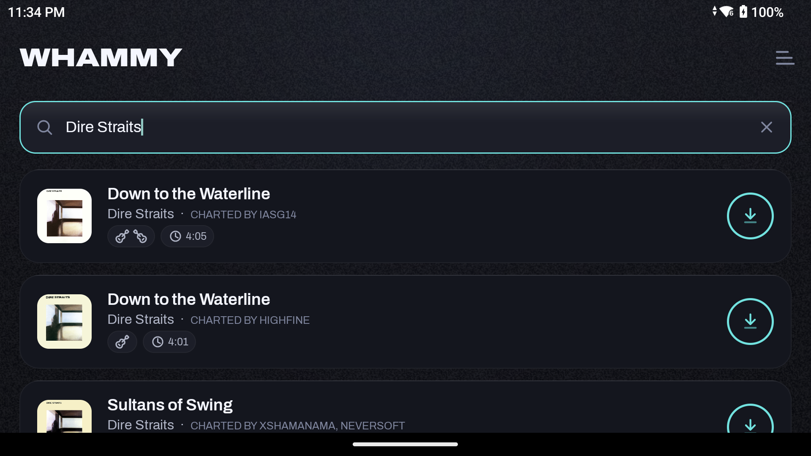
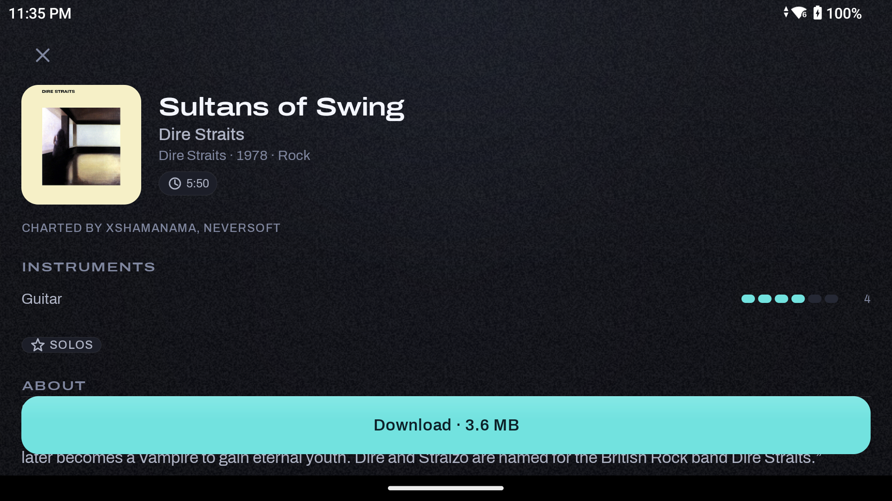
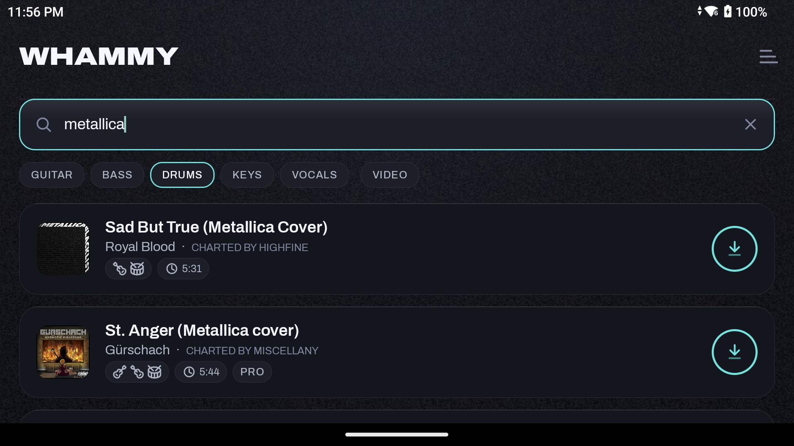

<div align="center">


# Whammy

**Search the [Encore / Chorus](https://www.enchor.us/) chart database and drop Clone Hero songs straight onto your Android device — no PC, no browser, no file shuffling.**

A native Android app with a flagship, Guitar-Hero-inspired design system.

</div>

---

## Why

Adding songs to [Clone Hero](https://clonehero.net/) on an Android handheld normally means: open a browser, search enchor.us, download a `.sng`, dig it out of Downloads, and move it into the obscure `Documents/Clone Hero/Songs` folder — then rescan. Whammy does all of that in a few taps, on the device itself.

## Features

- **Live search** of the Encore database — real cover art, instant results.
- **One-tap download** straight into `Documents/Clone Hero/Songs`, with a live progress ring.
- **Infinite-scroll pagination** and **filters** (by instrument, or "has video background").
- **Song detail screen** — big cover, album · year · genre, per-instrument **difficulty meters**, feature badges, the charter's description blurb, and the **download size** so you can judge before you grab a 200 MB setlist.
- **Setlist detection** — packs get a distinct badge, total length, and their "About" blurb.
- **At-a-glance badges** — instruments, duration, video, pro-drums, modchart.
- **Library management** — browse everything you've downloaded (with real album art pulled from each chart folder) and delete charts you're done with.

<div align="center">



</div>

## Design

A custom, cohesive design system built around Clone Hero's **note-highway** metaphor — a dark, emitted-light "stage," star-power cyan as the single action accent, the fret palette reserved for the app mark, and a "W-dive" (whammy-bend) wordmark. The full system is documented in [`docs/DESIGN.md`](docs/DESIGN.md).

## Under the hood

This app is deliberately built **without Gradle or Android Studio** — a hand-rolled, plain-SDK toolchain:

- **Build pipeline** (`build.sh`): `aapt2 → javac → d8 → zipalign → apksigner`, driven by a shell script.
- **AndroidX, vendored by hand.** RecyclerView and its transitive dependencies are fetched as raw AARs, their `res/` + manifests compiled and linked via `aapt2 --extra-packages` so the generated `androidx.*` `R` classes resolve at runtime — no build system doing it for you (see `vendor-libs.sh`).
- **Plain-SDK everything else** — async image loading with `LruCache` + `HttpURLConnection` (network *and* local album art), custom `View`s for the progress ring and difficulty meters, a small `.sng` (SNGPKG) header parser, and TDD-covered API/model/storage logic (`./test.sh`, JVM JUnit).
- The **Encore API** was reverse-engineered from the open-source [Bridge](https://github.com/Geomitron/Bridge) desktop chart-downloader.

## Build & run

```bash
./vendor-libs.sh          # fetch the AndroidX + Kotlin runtime jars into libs/ (once)
./test.sh                 # JVM unit tests for the Android-independent logic
./build.sh                # produce build/whammy.apk (needs Android SDK build-tools 35 + platform 34)
adb install -r build/whammy.apk
```

Then grant all-files access (the app requests it) so it can write into your Clone Hero Songs folder.

## Credits

- Charts & metadata: **[Chorus Encore](https://www.enchor.us/)** (the community chart database).
- API reference: **[Bridge](https://github.com/Geomitron/Bridge)** by Geomitron.
- Icons: **[Lucide](https://lucide.dev/)**. Type: **Archivo** / **Archivo Expanded** (OFL).

> Whammy is a fan-made tool for the Clone Hero community. It downloads only charts you choose, and is not affiliated with Clone Hero or Chorus Encore.
